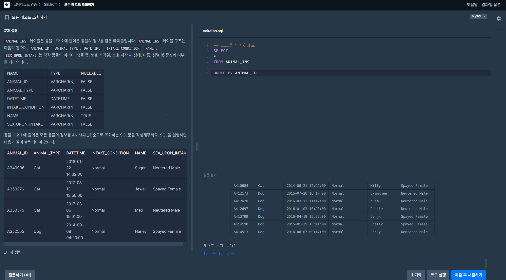
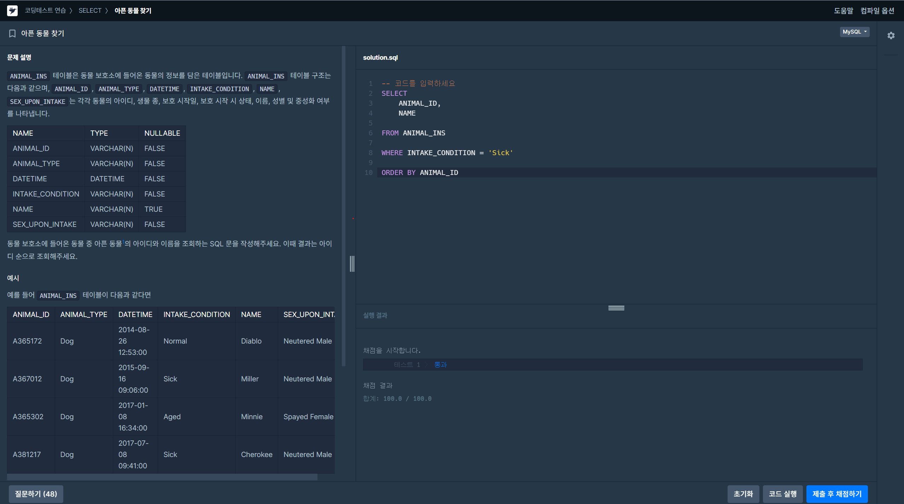

# 📘 SQL_BASIC 2주차 정규 과제

SQL_BASIC 정규 과제는 매주 정해진 분량의 `초보자를 위한 BigQuery(SQL) 입문` 강의를 듣고, 핵심 개념을 정리한 뒤 간단한 SQL 문제를 직접 풀어보는 방식으로 진행합니다.

이번 주는 저장된 데이터를 확인하는 방법과 `SELECT`, `FROM`, `WHERE`의 기본 구조를 학습합니다.

완성된 과제는 Github에 업로드하고, 링크를 스프레드시트 'SQL' 시트에 입력해 제출해주세요.

**👀 수행 인증란은 필수입니다.**

---

## 📚 SQL_BASIC_2nd_TIL

### 섹션 3. 데이터 탐색 - 조건, 추출, 요약

### 2-2. 저장된 데이터 확인하기(데이터베이스, 데이터 웨어하우스, ERD)

### 2-3. 데이터 탐색(SELECT, FROM, WHERE)

---

## ✨ 선택 강의

- 2-4. SELECT 연습 문제: SELECT, FROM, WHERE를 더 연습하고 싶을 때 선택 수강

---

## 🏁 전체 강의 수강 계획

| 주차 | 필수 강의 범위 | 선택 강의 | 완료 여부 |
| --- | --- | --- | --- |
| 1주차 | 1-1 ~ 2-1 | 1 | ✅ |
| 2주차 | 2-2 ~ 2-3 | 2-4 | ✅ |
| 3주차 | 2-5, 2-7 ~ 2-8 | 2-6 | 🍽️ |
| 4주차 | 3-2 ~ 4-3 | 3-4 | 🍽️ |
| 5주차 | 4-4 ~ 4-6 | 4-5, 4-7 | 🍽️ |
| 6주차 | 5-2 ~ 5-5 | 5-6 | 🍽️ |
| 7주차 | 필수 강의 없음 | 6-2, 6-3, 6-4, 6-5 | 🍽️ |

---

<br>

<!-- 여기까진 그대로 둬 주세요-->

---

# 1️⃣ 개념 정리

아래 키워드 중 중요하다고 생각한 개념을 2개 이상 골라 짧게 정리해주세요. 3개보다 더 많이 정리하고 싶다면 자유롭게 항목을 추가해도 좋습니다.

이번 주 키워드:
- SELECT
- FROM
- WHERE
- 조건식
- ORDER BY
- LIMIT
- 테이블 구조 확인

## 01.

```
개념 이름:SELECT, FROM, WHERE
개념 설명:
1.SELECT 
-테이블에서 어떤 컬럼을 가져올지 결정. 
-,로 각 컬럼을 구분, 마지막 컬럼 뒤엔 붙이지 않음

2.FROM
-어떤 테이블에서 데이터를 가져올지 지정
-프로젝트가 여러 개일 때 -> [프로젝트id.데이터셋.테이블]로 명시
-프로젝트가 하나일때에는 프로젝트 id는 생략해도됨

3.WHERE
-조건에 맞는 행을 걸러낼때 사용
-문자열 따옴표 쓰기. (숫자는 안써도 됨)

예시 쿼리:
SELECT 

  hp,
  attack

FROM `bigquery-kjy.basic.poketmon`

WHERE
  kor_name = '피카츄'


```

## 02.

```
개념 이름:LIMIT, EXCEPT 

개념 설명:
1.LIMIT
-결과 중 상위 몇 개만 가져오게 함
-행이 너무 많을 때 일부만 확인하기 위해 사용

2.EXCEPT
-SELECT *으로 전체 컬럼을 가져올 때, 그 중 특정 컬럼 제외할 때 사용

예시 쿼리:
SELECT 

  *EXCEPT(kor_name)

FROM `bigquery-kjy.basic.poketmon`

WHERE
  kor_name = '피카츄'

LIMIT 100

```

## (선택) 03.

```
개념 이름:SQL작성 순서 & 실행순서
개념 설명:
-SQL작성시- SELECT → FROM → WHERE 순서
-실제 쿼리 엔진이 처리하는 순서 - FROM → WHERE → SELECT
*하지만 쿼리문 작성할때 꼭 SELECT → FROM → WHERE 순서 맞추어서 작성 필요
헷갈린 점:
작성시와 실제 쿼리 엔진이 처리하는 순서가 달라서 헷갈렸다.
컴퓨터의 논리를 생각했을 떄 테이블을 먼저 정하고 , 조건에 맞게 거르고, 원하는 컬럼을 고르는 순서를 
이해할 수 있었다. 
```

---

# 2️⃣ 수행 인증란

아래 중 하나 이상을 첨부해주세요.

- 강의 수강 화면 캡처
- 문제 풀이 정답 화면 캡처
- SQL 실행 결과 화면 캡처


---

# 3️⃣ 확인 문제

프로그래머스는 로그인이 필요하므로, 로그인 후 문제 풀이를 진행해주세요.

## 🧩 문제 1

문제 링크: [모든 레코드 조회하기](https://school.programmers.co.kr/learn/courses/30/lessons/59034)

풀이 과정:
-- 코드를 입력하세요
SELECT
*
FROM ANIMAL_INS

ORDER BY ANIMAL_ID
```
- 테이블에서 확인한 컬럼:
ANIMAL_ID/ ANIMAL_TYPE/ DATETIME /INTAKE_CONDITION / NAME / SEX_UPON_INTAKE
- SELECT와 FROM을 작성한 방식:
모든 컬럼을 조회해야 해서 SELECT 뒤에 *를 사용했고 FROM으로 ANIMAL_INS 테이블을 불러왔고, ANIMAL_ID 순으로 정렬하기 위해 ORDER BY를 마지막에 작성했다.
- 새로 배운 점:
원하는 순서와 방식대로 정렬하는 ORDER BY를 사용하는 방법을 배웠다. 
```



## 🧩 문제 2

문제 링크: [아픈 동물 찾기](https://school.programmers.co.kr/learn/courses/30/lessons/59036)

풀이 과정:
SELECT
    ANIMAL_ID,
    NAME
    
FROM ANIMAL_INS 

WHERE INTAKE_CONDITION = 'Sick'

ORDER BY ANIMAL_ID

```
- 문제에서 요구한 조건:
동물 보호소에 들어온 동물 중 아픈(INTAKE_CONDITION이 'Sick'인) 동물의 아이디와 이름을 아이디 순으로 조회
- WHERE 절로 옮긴 방식:
INTAKE_CONDITION 컬럼이 문자열 타입이라 'Sick'을 작은따옴표로 감싸서 조건을 걸었다
- 정렬 기준이 있다면 사용한 기준:
ORDER BY 이용 -> ANIMAL_ID순으로 정렬
- 새로 배운 점:
처음에 ORDER BY를 안해도 결과가 옳게 나왔는데, 내가 원하는 결과가 무엇인지 꼼꼼하게 검토해서 쿼리 작성을 해야겠다. 또한 결과가 우연히 나온것인지, 내가 작성한 의도대로 나온것인지 검토해야한다.
```

---

# 4️⃣ 이번 주 회고

```
1. SELECT, FROM, WHERE 중 가장 헷갈린 개념:
WHERE. 컬럼의 데이터 타입(STRING/INTEGER)에 따라 따옴표를 붙이거나 빼야 한다는 규칙을 처음엔 몰라서 헷갈렸다. 
2. 문제를 풀 때 가장 자주 확인하게 된 부분:
컬럼의 데이터 타입을 먼저 확인하고, 그에 맞게 따옴표를 붙일지 말지 판단하는 것. 또한 SELECT에서 콤마 위치(마지막 컬럼 뒤에는 콤마를 붙이지 않는 것)를 자주 확인했다.
3. 다음 주 문제 풀이에서 의식하고 싶은 습관: 문제가 요구하는 바가 무엇인지 한번 더 생각하고, 그에 맞는 쿼리를 짜고 싶다. 
```

수고하셨습니다!


