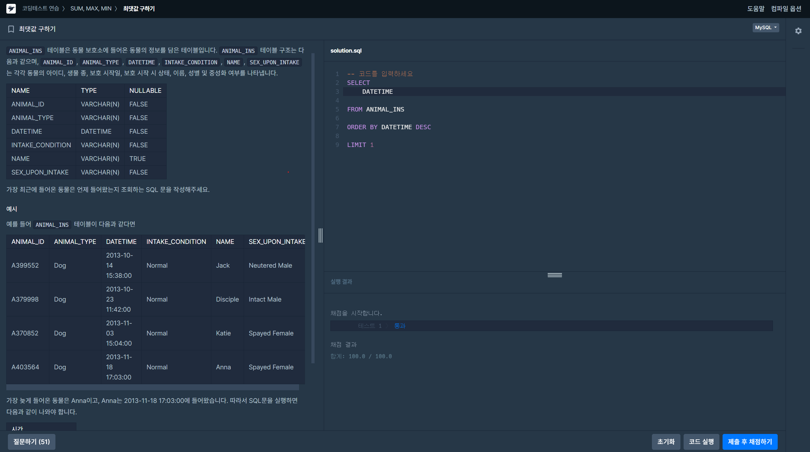
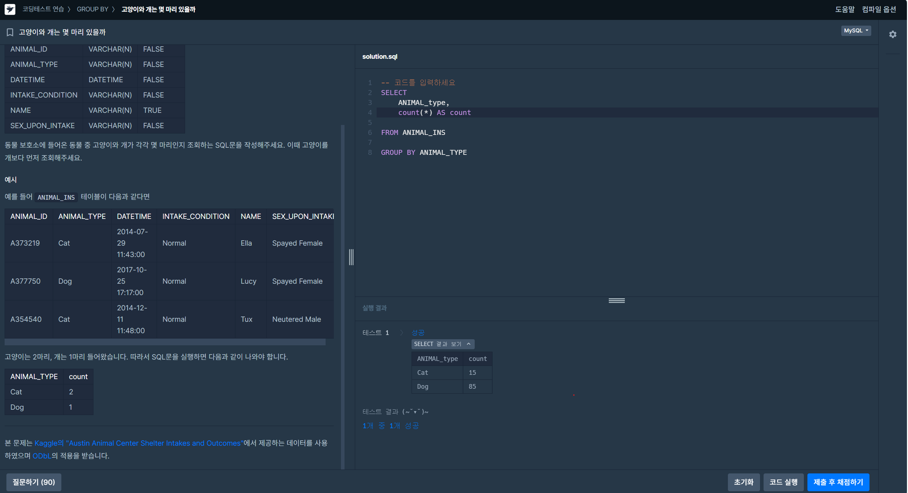

# 📘 SQL_BASIC 3주차 정규 과제

SQL_BASIC 정규 과제는 매주 정해진 분량의 `초보자를 위한 BigQuery(SQL) 입문` 강의를 듣고, 핵심 개념을 정리한 뒤 간단한 SQL 문제를 직접 풀어보는 방식으로 진행합니다.

이번 주는 집계 함수와 `GROUP BY`, `HAVING`을 학습합니다.

완성된 과제는 Github에 업로드하고, 링크를 스프레드시트 'SQL' 시트에 입력해 제출해주세요.

**👀 수행 인증란은 필수입니다.**

---

## 📚 SQL_BASIC_3rd_TIL

### 섹션 3. 데이터 탐색 - 조건, 추출, 요약

### 2-5. 집계(GROUP BY + HAVING + SUM/COUNT)

### 2-7. 정리

### 2-8. 새로운 집계 함수 소개(GROUP BY ALL, 2024-02-26에 나온 함수)

---

## ✨ 선택 강의

- 2-6. 연습 문제: 집계와 조건 조회를 더 연습하고 싶을 때 선택 수강

---

## 🏁 전체 강의 수강 계획

| 주차 | 필수 강의 범위 | 선택 강의 | 완료 여부 |
| --- | --- | --- | --- |
| 1주차 | 1-1 ~ 2-1 | 1 | ✅ |
| 2주차 | 2-2 ~ 2-3 | 2-4 | ✅ |
| 3주차 | 2-5, 2-7 ~ 2-8 | 2-6 | ✅ |
| 4주차 | 3-2 ~ 4-3 | 3-4 | 🍽️ |
| 5주차 | 4-4 ~ 4-6 | 4-5, 4-7 | 🍽️ |
| 6주차 | 5-2 ~ 5-5 | 5-6 | 🍽️ |
| 7주차 | 필수 강의 없음 | 6-2, 6-3, 6-4, 6-5 | 🍽️ |

---

<br>

<!-- 여기까진 그대로 둬 주세요-->

---

# 1️⃣ 개념 정리

아래 키워드 중 중요하다고 생각한 개념을 2개 이상 골라 짧게 정리해주세요. 3개보다 더 많이 정리하고 싶다면 자유롭게 항목을 추가해도 좋습니다.

이번 주 키워드:
- COUNT
- SUM
- AVG
- MAX
- MIN
- GROUP BY
- HAVING
- 집계 기준

## 01.

```
개념 이름: GROUP BY + 집계 함수 (집계 기준)
개념 설명: GROUP BY는 지정한 컬럼(집계 기준)의 값이 같은 행끼리 하나의 그룹으로 묶음. 묶고 나면 그룹당 한 줄만 남기 때문에, SELECT에는 GROUP BY에 적은 컬럼과 집계 함수(COUNT, SUM, AVG, MAX, MIN)로 감싼 컬럼만 쓸 수 있음. 그래서 SELECT *는 쓸 수 없음. 집계 기준 컬럼은 SELECT에도 같이 적어야 결과에서 각 숫자가 어느 그룹의 값인지 알 수 있음. 문제에 "~별로"라는 표현이 나오면 GROUP BY를 떠올리면 됨. COUNT(*)는 특정 컬럼 값이 아니라 그룹 안의 행 개수를 셈.
예시 쿼리:
SELECT
  type1,
  COUNT(*) AS pokemon_count,
  AVG(attack) AS avg_attack
FROM basic.poketmon
GROUP BY type1
```

## 02.

```
개념 이름: WHERE와 HAVING
개념 설명: 둘 다 조건으로 걸러내는 절이지만 조건을 거는 시점과 대상이 다름. WHERE는 그룹화하기 전에 원본 테이블의 각 행에 조건을 검. HAVING은 GROUP BY로 집계한 뒤의 결과에 조건을 검. 그래서 "type2가 없는 포켓몬"처럼 행 하나하나의 값에 대한 조건은 WHERE, "포켓몬 수가 10 이상인 타입"처럼 집계 결과에 대한 조건은 HAVING을 씀. SQL은 FROM → WHERE → GROUP BY → HAVING → SELECT → ORDER BY → LIMIT 순서로 실행되기 때문에, GROUP BY 이후에는 그룹화에 쓰지 않은 원본 컬럼(예: type2)을 HAVING에서 쓸 수 없음.
예시 쿼리:
SELECT
  type1,
  COUNT(*) AS poketmon_count
FROM basic.poketmon
WHERE type2 IS NOT NULL
GROUP BY type1
HAVING poketmon_count >= 10
ORDER BY poketmon_count DESC
```

## (선택) 03.

```
개념 이름: COUNT(*)와 COUNT(DISTINCT 컬럼)
개념 설명: COUNT(*)는 행이 몇 개인지 셈. COUNT(컬럼)은 그 컬럼이 NULL이 아닌 행만 세고, COUNT(DISTINCT 컬럼)은 거기에 중복까지 제거하고 고유한 값의 개수만 셈. 예를 들어 메인 페이지 조회 수는 COUNT(user_id), 조회한 유저 수는 COUNT(DISTINCT user_id)로 구함.
헷갈린 점: COUNT(*)는 되는데 COUNT(DISTINCT *)는 안 되는 이유가 헷갈렸음. DISTINCT는 어떤 값을 기준으로 중복을 제거할지 컬럼을 지정해야 하는데 *는 모든 컬럼을 가리키기 때문에 쓸 수 없음. 또 COUNT(poketmon)처럼 테이블 이름을 컬럼처럼 넣는 실수도 했는데, 행 개수를 세려면 COUNT(*)를 쓰면 됨.
```

---

# 2️⃣ 수행 인증란

아래 중 하나 이상을 첨부해주세요.

- 강의 수강 화면 캡처
- 문제 풀이 정답 화면 캡처
- SQL 실행 결과 화면 캡처

---

# 3️⃣ 확인 문제

프로그래머스는 로그인이 필요하므로, 로그인 후 문제 풀이를 진행해주세요.

## 🧩 문제 1

문제 링크: [최댓값 구하기](https://school.programmers.co.kr/learn/courses/30/lessons/59415)

풀이 과정:

```
- 문제 요구사항: 가장 최근에 들어온 동물이 언제 들어왔는지 조회
- 사용한 SQL 절: Select, from, order by, limit
- 새로 배운 점: 결과가 오류 없이 나와도 해당 결과가 문제에서 의도하는 것인지 확인해야 한다. '언제'라는 질문이였기 때문에 DATETIME컬럼 하나만 SELECT해야 하는데 *을 이용해 전체 컬럼을 뽑았었다. 이렇게 문제가 의도하는 바가 무엇인지 꼼꼼하게 생각해야 한다. 
```



## 🧩 문제 2

문제 링크: [가장 비싼 상품 구하기](https://school.programmers.co.kr/learn/courses/30/lessons/131697)

풀이 과정:

```
- 사용한 집계 함수:MAX()
- 집계 대상 컬럼: PRICE
- 결과를 검증한 방법: MAX(PRICE)를 이용해서 85000이라는 결과 확인. 

```

[alt text](image-4.png)

## 🧩 문제 3

문제 링크: [고양이와 개는 몇 마리 있을까](https://school.programmers.co.kr/learn/courses/30/lessons/59040)

풀이 과정:

```
- 그룹화 기준:ANIMAL_TYPE
- WHERE와 HAVING 중 사용한 절: 둘 다 사용 x - 전체 데이터를 타입별로만 집계하면 되어서 GROUP BY 사용.
- 처음 틀렸다면 틀린 이유: COUNT(*) 이후 AS를 사용해 별칭을 붙일 때 명령어와 같은 count를 붙여도 되는지 몰라서 쓰지 않았는데 사용해도 괜찮았음. 
- 새로 배운 SQL 패턴: 집계 함수의 계산 결과와 결과 컬럼의 이름 생각. - 특정 컬럼명을 요구할 때 AS 사용
```



---

# 4️⃣ 이번 주 회고

```
1. 문제를 SQL로 옮길 때 가장 어려웠던 부분: SELECT가 어떻게 돌아가는지 이해하는 것이 가장 어려웠음. 쿼리는 SELECT가 맨 위에 쓰여 있어서 SELECT가 제일 먼저 실행될 것 같았는데, 그렇게 생각하니 왜 GROUP BY 뒤에 SELECT *를 못 쓰는지, 왜 SELECT에 GROUP BY 기준 컬럼을 같이 적어야 하는지, 왜 HAVING에서 type2 같은 원본 컬럼을 못 쓰는지 이해가 되지 않았음. 그래서 GROUP BY 앞뒤로 컬럼을 빠뜨리거나 절 순서를 틀리는 실수를 반복했음. SELECT는 "무엇을 보여줄지 정하는 단계"이고, 앞 단계(FROM, WHERE, GROUP BY)를 거치고 남은 것만 보여줄 수 있다는 점을 알고 나서야 이 오류들이 하나로 연결되었음.
2. WHERE와 HAVING의 차이를 어떻게 이해했는지: 쿼리를 쓰는 순서(SELECT → FROM → WHERE → GROUP BY → HAVING → ORDER BY → LIMIT)와 컴퓨터가 실제로 실행하는 순서(FROM → WHERE → GROUP BY → HAVING → SELECT → ORDER BY → LIMIT)가 다르다는 것을 알고 나서 이해했음. WHERE는 GROUP BY 전에 실행되므로 원본 테이블의 행에 거는 조건이고, HAVING은 GROUP BY 후에 실행되므로 집계가 끝난 그룹에 거는 조건임. 즉 두 절은 실행되는 시점이 달라서 조건을 거는 대상이 다름.
3. 다음 주에 더 연습하고 싶은 문제 유형: 이번 주에 풀지 못한 연습 문제들처럼 IN, LIKE, COUNTIF를 함께 쓰는 문제와, 동명이인 찾기·비율 구하기처럼 GROUP BY와 HAVING을 여러 단계로 조합해야 하는 문제를 더 연습하고 싶음. 문제가 실제로 묻는 것이 무엇인지 확인하고 결과를 검증하는 습관도 계속 이어가려고 함.
```

수고하셨습니다!


