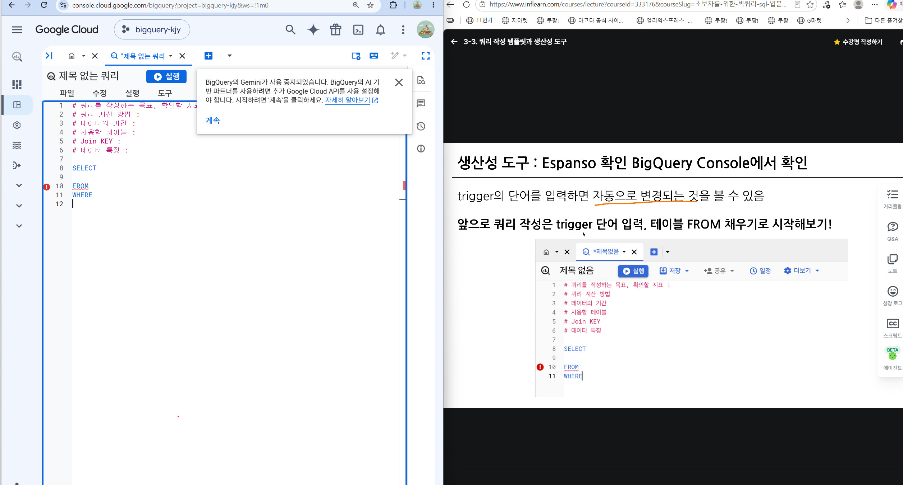
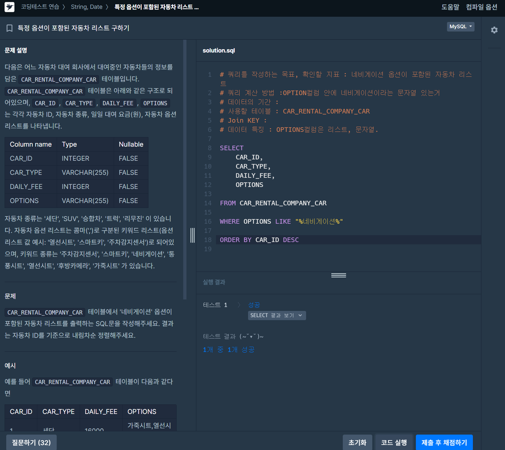
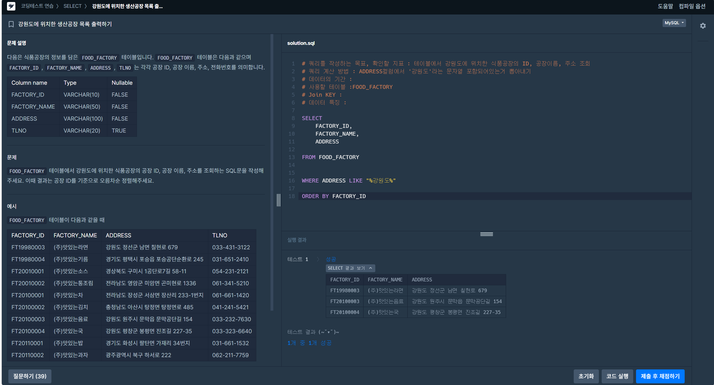
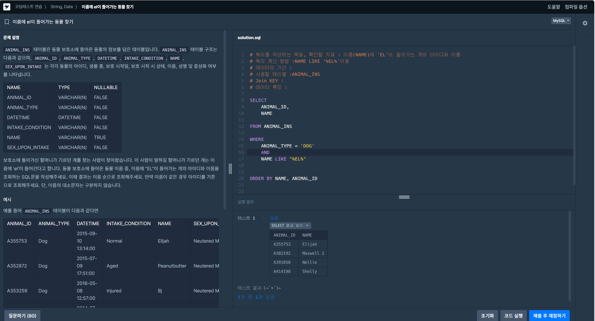
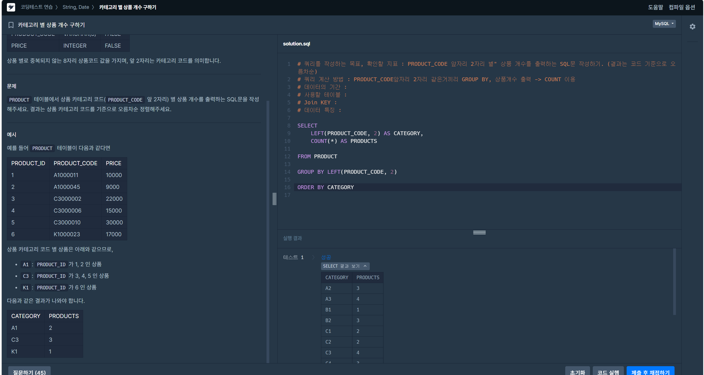

# 📘 SQL_BASIC 4주차 정규 과제

SQL_BASIC 정규 과제는 매주 정해진 분량의 `초보자를 위한 BigQuery(SQL) 입문` 강의를 듣고, 핵심 개념을 정리한 뒤 간단한 SQL 문제를 직접 풀어보는 방식으로 진행합니다.

이번 주는 SQL 쿼리를 작성하는 흐름, 쿼리 작성 템플릿, 데이터 타입 변환, 문자열 함수를 학습합니다.

완성된 과제는 Github에 업로드하고, 링크를 스프레드시트 'SQL' 시트에 입력해 제출해주세요.

**👀 수행 인증란은 필수입니다.**

---

## 📚 SQL_BASIC_4th_TIL

### 섹션 4. SQL 쿼리 잘 작성하기, 쿼리 작성 템플릿 및 오류를 잘 디버깅하기

### 3-2. SQL 쿼리를 작성하는 흐름

### 3-3. 쿼리 작성 템플릿과 생산성 도구

### 섹션 5. 데이터 탐색 - 변환

### 4-1. INTRO

### 4-2. 데이터 타입과 데이터 변환(CAST, SAFE_CAST)

### 4-3. 문자열 함수(CONCAT, SPLIT, REPLACE, TRIM, UPPER)

---

## ✨ 선택 강의

- 3-4. 오류를 디버깅하는 방법: 오류 메시지 해석과 디버깅 흐름을 더 익히고 싶을 때 선택 수강

---

## 🏁 전체 강의 수강 계획

| 주차 | 필수 강의 범위 | 선택 강의 | 완료 여부 |
| --- | --- | --- | --- |
| 1주차 | 1-1 ~ 2-1 | 1 | ✅ |
| 2주차 | 2-2 ~ 2-3 | 2-4 | ✅ |
| 3주차 | 2-5, 2-7 ~ 2-8 | 2-6 | ✅ |
| 4주차 | 3-2 ~ 4-3 | 3-4 | ✅ |
| 5주차 | 4-4 ~ 4-6 | 4-5, 4-7 | 🍽️ |
| 6주차 | 5-2 ~ 5-5 | 5-6 | 🍽️ |
| 7주차 | 필수 강의 없음 | 6-2, 6-3, 6-4, 6-5 | 🍽️ |

---

<br>

<!-- 여기까진 그대로 둬 주세요-->

---

# 1️⃣ 개념 정리

아래 키워드 중 중요하다고 생각한 개념을 2개 이상 골라 짧게 정리해주세요. 3개보다 더 많이 정리하고 싶다면 자유롭게 항목을 추가해도 좋습니다.

이번 주 키워드:
- 쿼리 작성 순서
- 쿼리 작성 템플릿
- 데이터 타입
- CAST
- SAFE_CAST
- CONCAT
- REPLACE
- TRIM

## 01.

```
개념 이름: 쿼리 작성 순서

개념 설명:
- 쿼리: [어떤 테이블에서(FROM) → 어떤 행만(WHERE) → 어떻게 묶어서(GROUP BY)
  → 묶은 결과 중 조건(HAVING) → 어떤 컬럼을(SELECT) → 어떤 순서로(ORDER BY)
  → 몇 개만(LIMIT)] 
- 문법상 작성 순서는 다름**
    [SELECT → FROM → WHERE → GROUP BY → HAVING → ORDER BY → LIMIT]
- 실제로 엔진이 처리하는 순서(실제 과정)
    [FROM → WHERE → GROUP BY → HAVING → SELECT → ORDER BY → LIMIT]
- 처리 순서 때문에 생기는 규칙
    -  WHERE는 SELECT보다 먼저 실행되므로 SELECT에서 만든 별칭 사용 x
    - ORDER BY는 SELECT 뒤에 실행되므로 별칭 o
    -  그룹 결과에 조건 -> HAVING (WHERE X)
      (WHERE는 그룹으로 묶기 전, HAVING은 묶은 후에 실행되기 때문)
- -> [테이블 정하기 → 조건으로 거르기 → 원하는 컬럼 고르기 → 정렬]

예시 쿼리:
-- 지역별로 2020년 이후 주문 건수를 세고 건수가 10건 이상인 지역만 많은 순으로 5개 보기
SELECT
  region,                          -- 5. 컬럼 선택 (SELECT)
  COUNT(*) AS order_cnt
FROM orders                        -- 1. 테이블 선택 (FROM)
WHERE order_date >= '2020-01-01'   -- 2. 행 거르기 (WHERE)
GROUP BY region                    -- 3. 지역별로 묶기 (GROUP BY)
HAVING COUNT(*) >= 10              -- 4. 묶은 결과 거르기 (HAVING)
ORDER BY order_cnt DESC            -- 6. 정렬 (별칭 사용 가능) (ORDER BY)
LIMIT 5                            -- 7. 개수 제한 (LIMIT)
```

## 02.

```
개념 이름: 쿼리 작성 템플릿과 오류
개념 설명:
1. 쿼리 작성 템플릿 (espanso)
- 템플릿: 쿼리의 뼈대(SELECT / FROM / WHERE / GROUP BY / HAVING / ORDER BY / LIMIT)를
  미리 만들어 두고 필요한 부분만 채워 넣는 방식
- 활용: 매번 처음부터 쓰지 않아 빠르고, 절 순서나 문법 실수를 줄일 수 있음
- 쓰는 방법
    - 절마다 줄을 바꾸고 들여쓰기 -> 어느 절에서 문제인지 찾기 쉬움
    - 처음엔 SELECT * + LIMIT으로 데이터부터 확인 -> 조건, 컬럼을 하나씩 추가
    - 쓰지 않는 절, 컬럼 설명, 조건은 지우거나 주석(--)처리
- 생산성 도구: 자동완성 단축키(Ctrl+Enter 실행, Ctrl+/ 주석), 쿼리 저장 기능 활용

2. 오류
- 오류가 나면 메시지부터 읽는다 -> 메시지에 오류 종류와 위치(줄, 열)가 나온다
- 자주 나오는 오류
    - 문법 오류 (Syntax error): 쉼표, 괄호, 따옴표 빠짐, 절 순서 틀림, 오타
    - 이름 오류 (Unrecognized name / Not found): 컬럼명, 테이블명 오타 또는 없는 이름
    - 타입 오류 (No matching signature): 숫자와 문자 등 타입이 안 맞는 비교, 연산
    - 집계 오류: GROUP BY 쿼리에서 묶지도, 집계하지도 않은 컬럼을 SELECT에 씀
- 디버깅 순서
    (1) 오류 메시지의 줄 번호 확인 -> (2) 그 줄과 바로 윗줄 확인(쉼표, 괄호, 오타)
    -> (3) 스키마에서 컬럼명, 타입 확인 -> (4) 절을 하나씩 주석 처리하며 나눠서 실행
    -> (5) 그래도 안 되면 오류 메시지를 그대로 검색

예시 쿼리:
-- 템플릿: 필요한 절만 채워 쓰기
SELECT
  region,
  COUNT(*) AS order_cnt
FROM orders
WHERE order_date >= '2020-01-01'
GROUP BY region
ORDER BY order_cnt DESC
LIMIT 100

-- 오류 예시 (SELECT 뒤 쉼표 빠짐 -> Syntax error)
SELECT region COUNT(*) AS order_cnt   -- X
SELECT region, COUNT(*) AS order_cnt  -- O

-- 오류 예시 (묶지도 집계하지도 않은 컬럼 -> 집계 오류)
SELECT region, order_date, COUNT(*) FROM orders GROUP BY region        -- X
SELECT region, order_date, COUNT(*) FROM orders GROUP BY region, order_date  -- O
```

## (선택) 03.

```
개념 이름: 데이터 타입 변환하기 (CAST, SAFE_CAST)
개념 설명:
1. CAST
- 값의 데이터 타입을 다른 타입으로 바꾸는 함수
- 문법: CAST(값 AS 바꿀타입)   
- 활용: 숫자가 문자로 저장돼 있어 계산이나 비교가 안 될 때 / 숫자를 문자열로 이어 붙일 때
- 주의: 바꿀 수 없는 값(예: 'abc' -> INT64)이 하나라도 있으면 오류발생

2. SAFE_CAST
- CAST와 같은 기능, 변환에 실패하면 오류 대신 NULL을 반환
- 문법: SAFE_CAST(값 AS 바꿀타입)   예) SAFE_CAST('abc' AS INT64) -> NULL
- 언제 쓰나: 데이터에 이상한 값이 섞여 있을 수 있을 때 (오류X, 쿼리 계속됨)
- 주의: 변환 실패가 NULL로 조용히 넘어가므로 어떤 행이 NULL이 됐는지 확인 필요


헷갈린 점: espanso관련 (역할, 경로 지정, 사용법)
- 역할
    - espanso = 지정한 짧은 글자(트리거)를 치면 미리 저장해 둔 긴 텍스트로 자동으로 바꿔 주는 도구
    - 예) ;sel 입력 -> SELECT / FROM / WHERE ... 쿼리 템플릿이 통째로 입력됨
    - BigQuery 전용이 아니라 어떤 입력창에서든 동작함 (VS Code, 브라우저 등)
- 경로 지정
    - espanso는 설정 폴더 안의 yml 파일을 읽어서 동작함
    - 내 컴퓨터의 설정 폴더 위치는 터미널에서 espanso path 로 확인
    - 템플릿은 그 폴더 안의 match 폴더 > base.yml 에 적음
    - 파일을 직접 찾기 어려우면 espanso edit 로 바로 열 수 있음
- 사용법
    1) match/base.yml 에 트리거와 치환 텍스트 등록
       matches:
         - trigger: ";sel"
           replace: |
             SELECT
               $|$
             FROM
             WHERE
             LIMIT 100
       (| 는 여러 줄 입력, $|$ 는 치환 후 커서가 놓일 위치)
    2) 저장 후 espanso restart (설정 반영)
    3) 편집기에서 ;sel 입력 -> 템플릿으로 자동 변환

```

---

# 2️⃣ 수행 인증란

아래 중 하나 이상을 첨부해주세요.

- 강의 수강 화면 캡처
- 문제 풀이 정답 화면 캡처
- SQL 실행 결과 화면 캡처

---

# 3️⃣ 확인 문제

프로그래머스는 로그인이 필요하므로, 로그인 후 문제 풀이를 진행해주세요.

## 🧩 문제 1

문제 링크: [특정 옵션이 포함된 자동차 리스트 구하기](https://school.programmers.co.kr/learn/courses/30/lessons/157343)

풀이 과정:
- 찾으려는 문자열 조건:  OPTIONS 안에 '네비게이션'이 포함된 행
- 사용한 문자열 조건 문법:LIKE '%네비게이션%' (% = 앞뒤에 아무 글자나 와도 됨)
- 정렬 기준:CAR_ID 내림차순 (ORDER BY CAR_ID DESC)

어려웠던 점:

- CAST가 필요하다고 생각했는데 OPTIONS는 이미 VARCHAR(255)라서 CAST 자체가 불필요했음
- CAST를 쓰더라도 STRING이 아니라 CHAR (MySQL 문법) — STRING은 BigQuery 문법
- CAST는 "값이 오는 자리"에만 넣을 수 있음 (SELECT 컬럼, WHERE 조건 안) → FROM엔 못 넣음
- IN은 완전히 똑같은 값인지 확인하는 것 → OPTIONS처럼 콤마로 이어진 문자열엔 안 맞음, "포함 여부"를 볼 땐 LIKE
- IN 뒤에는 반드시 괄호 필요: IN ('네비게이션')

```



## 🧩 문제 2

문제 링크: [강원도에 위치한 생산공장 목록 출력하기](https://school.programmers.co.kr/learn/courses/30/lessons/131112)

풀이 과정:

```
- 문제에서 요구한 조건: FOOD_FACTORY 테이블에서 주소(ADDRESS)에 '강원도'가 포함된 공장의 FACTORY_ID, FACTORY_NAME, ADDRESS 조회
- WHERE 절로 옮긴 방식:WHERE ADDRESS LIKE "%강원도%" (ADDRESS 문자열 안에 '강원도'가 포함되어 있는지 확인)
- 정렬 기준: ID기준 오름차순. -> ORDER BY FACTORY_ID (오름차순이 기본 패시브)
```



## 🧩 문제 3

문제 링크: [이름에 el이 들어가는 동물 찾기](https://school.programmers.co.kr/learn/courses/30/lessons/59047)

풀이 과정:

```
- 찾으려는 문자열 패턴:NAME에 'EL'이 포함된 경우 (LIKE '%EL%')
- 대소문자를 처리한 방식:LIKE '%EL%'만으로 el/El/EL 다 잡힘 (MySQL의 경우 기본적으로 대소문자 구분을 안함. )
- 정렬 기준:NAME 오름차순, 이름이 같으면 ANIMAL_ID 오름차순 (ORDER BY NAME, ANIMAL_ID)

배운것들:
- 조건이 여러 개면 WHERE에 각각 적고 AND로 연결한다
- ANIMAL_TYPE = 'Dog' 조건을 빼먹어서 개가 아닌 동물까지 다 나와버림 → 문제 설명에서 조건을 하나씩 체크리스트처럼 뽑아보는 습관 필요
- ORDER BY에 컬럼을 콤마로 여러 개 나열하면 1차 기준이 같을 때만 2차 기준으로 다시 정렬함


```



## 🧩 문제 4

문제 링크: [카테고리 별 상품 개수 구하기](https://school.programmers.co.kr/learn/courses/30/lessons/131529)

풀이 과정:

```
- 추출한 문자열 범위:PRODUCT_CODE의 앞 2자리 → LEFT(PRODUCT_CODE, 2)
- 그룹화 기준: LEFT(PRODUCT_CODE, 2) (SELECT에서 쓴 표현식과 동일하게 GROUP BY에도 사용)
- 정렬 기준:CATEGORY(별칭) 오름차순

배운것들:

- 문자열 앞 N글자를 뽑을 때는 LEFT(문자열, 개수) 사용 (SUBSTRING(문자열, 1, 개수)도 동일)
- COUNT(*)는 괄호 필수 — COUNT * 는 문법 오류
- WHERE는 GROUP BY 전에 "행"을 거를 때, HAVING은 GROUP BY 후에 "그룹"을 거를 때 사용
- 전체 데이터를 조건 없이 그냥 그룹별로 나눠서 세는 경우엔 WHERE도 HAVING도 필요 없음
- ORDER BY에는 SELECT에서 만든 별칭(CATEGORY)을 그대로 써도 됨

```



---

# 4️⃣ 이번 주 회고

```
1. 쿼리 작성 흐름을 잡을 때 도움이 된 방법:
2. 타입 변환이나 문자열 처리에서 조심해야 할 점:
3. 앞으로 문제 풀이 때 먼저 확인할 것:
```

수고하셨습니다!


