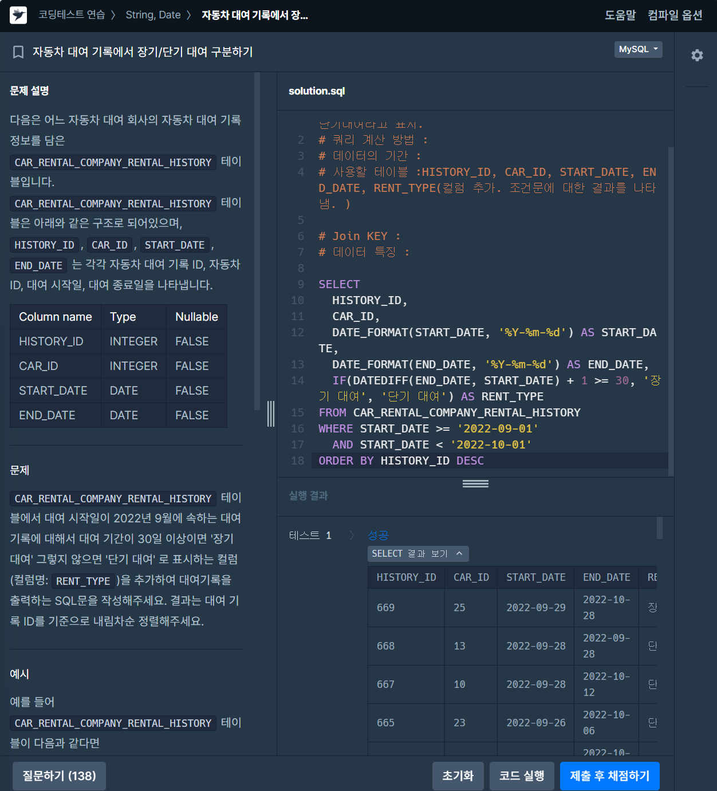
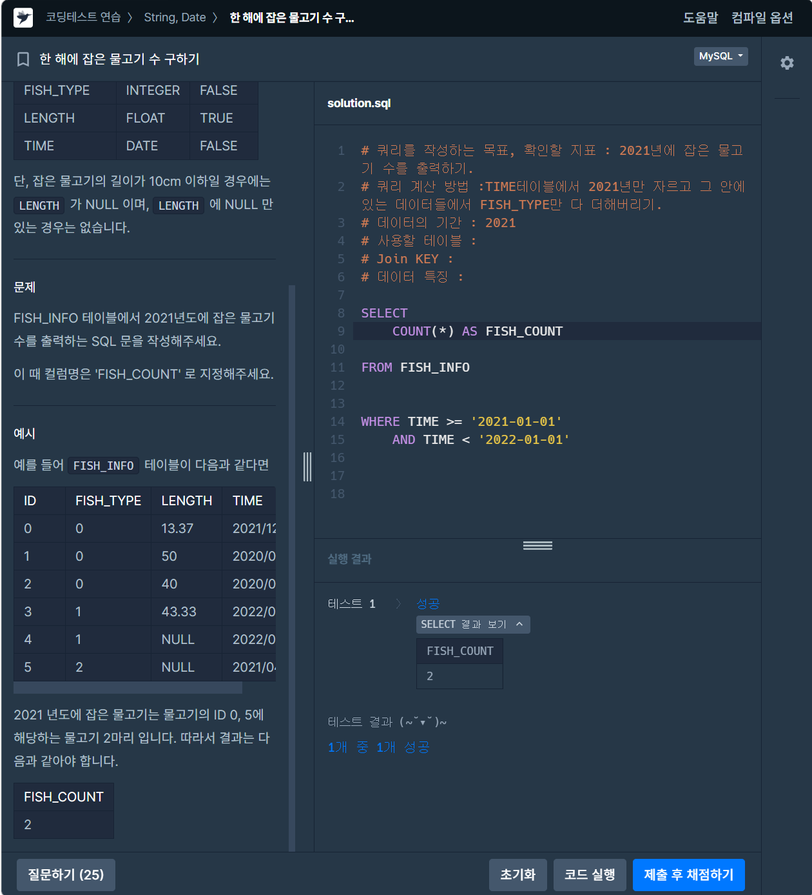
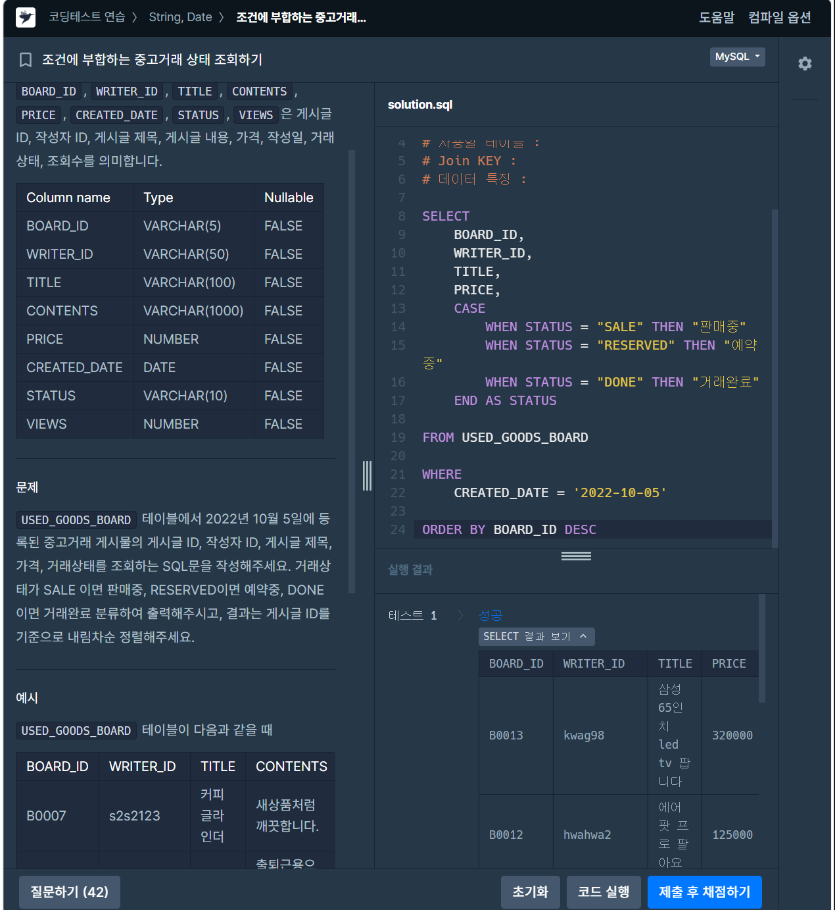
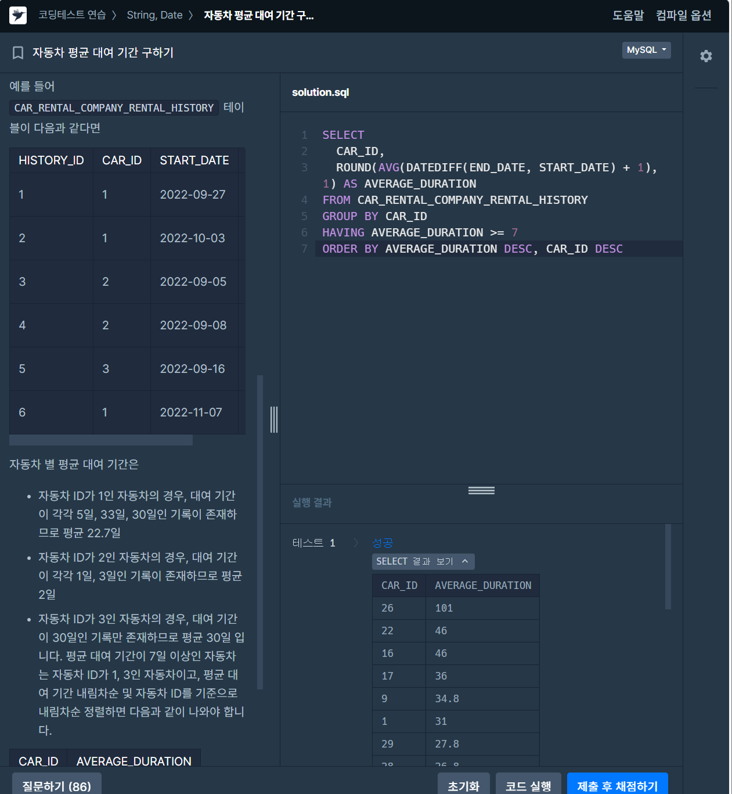

# 📘 SQL_BASIC 5주차 정규 과제

SQL_BASIC 정규 과제는 매주 정해진 분량의 `초보자를 위한 BigQuery(SQL) 입문` 강의를 듣고, 핵심 개념을 정리한 뒤 간단한 SQL 문제를 직접 풀어보는 방식으로 진행합니다.

이번 주는 날짜/시간 데이터와 조건문을 학습합니다. 특히 `CASE WHEN`은 SQL 문제 풀이와 데이터 분석에서 자주 사용되므로, 직접 분류 기준을 만들고 결과를 확인하는 연습을 해주세요.

완성된 과제는 Github에 업로드하고, 링크를 스프레드시트 'SQL' 시트에 입력해 제출해주세요.

**👀 수행 인증란은 필수입니다.**

---

## 📚 SQL_BASIC_5th_TIL

### 섹션 5. 데이터 탐색 - 변환

### 4-4. 날짜 및 시간 데이터 이해하기

### 4-6. 조건문(CASE WHEN, IF)

---

## ✨ 선택 강의

- 4-5. 시간 데이터 연습문제: 날짜/시간 함수를 더 연습하고 싶을 때 선택 수강
- 4-7. 조건문 연습문제: CASE WHEN과 IF를 더 연습하고 싶을 때 선택 수강

---

## 🏁 전체 강의 수강 계획

| 주차 | 필수 강의 범위 | 선택 강의 | 완료 여부 |
| --- | --- | --- | --- |
| 1주차 | 1-1 ~ 2-1 | 1 | ✅ |
| 2주차 | 2-2 ~ 2-3 | 2-4 | ✅ |
| 3주차 | 2-5, 2-7 ~ 2-8 | 2-6 | ✅ |
| 4주차 | 3-2 ~ 4-3 | 3-4 | ✅ |
| 5주차 | 4-4 ~ 4-6 | 4-5, 4-7 | ✅ |
| 6주차 | 5-2 ~ 5-5 | 5-6 | 🍽️ |
| 7주차 | 필수 강의 없음 | 6-2, 6-3, 6-4, 6-5 | 🍽️ |

---

<br>

<!-- 여기까진 그대로 둬 주세요-->

---

# 1️⃣ 개념 정리

아래 키워드 중 중요하다고 생각한 개념을 2개 이상 골라 짧게 정리해주세요. 3개보다 더 많이 정리하고 싶다면 자유롭게 항목을 추가해도 좋습니다.

이번 주 키워드:
- DATE
- DATETIME
- TIMESTAMP
- EXTRACT
- DATETIME_TRUNC
- FORMAT_DATETIME
- CASE WHEN
- IF

## 01.

```
개념 이름: 날짜 및 시간데이터
개념 설명:
1. UTC & GMT
- GMT: 영국 그리니치 천문대 기준 시간 (태양과 지구 자전 기준)
- UTC: 국제 표준시(협정 세계시), 원자시계 기준. 사실상 GMT와 같은 시간
- 한국은 UTC+9

2. TIMESTAMP & DATETIME
- DATE: 날짜만 (2023-12-31)
- DATETIME: 날짜 + 시간, 타임존 정보 없음
- TIMESTAMP: 특정 시점에 찍은 도장 값, UTC 기준이라 타임존 정보 있음
- 회사 테이블은 TIMESTAMP로 저장된 경우가 많으니 백엔드 개발자에게 확인
- TIMESTAMP → 한국 시간 DATETIME: DATETIME(ts, 'Asia/Seoul')

3. DATETIME 함수
- (1) CURRENT_DATETIME: 현재 시각 (타임존 생략 시 UTC)
- (2) EXTRACT: 특정 부분만 추출 (EXTRACT(HOUR FROM dt))
- (3) DATETIME_TRUNC: 지정 단위까지 남기고 자르기 (작은 단위는 0으로 초기화)
- (4) PARSE_DATETIME: 문자열 → DATETIME
- (5) FORMAT_DATETIME: DATETIME → 문자열 (PARSE와 반대 방향)
- (6) LAST_DAY: 월(기본)/주의 마지막 날
- (7) DATETIME_DIFF: 두 값의 차이, 첫 번째 − 두 번째 (정수 반환)

예시 쿼리:
SELECT
  DATETIME_TRUNC(DATETIME "2024-03-02 14:42:13", HOUR) AS hour_trunc,  -- 2024-03-02 14:00:00
  EXTRACT(DAYOFWEEK FROM DATETIME "2024-03-02 14:42:13") AS dow        -- 1=일 ... 7=토
```

## 02.

```
개념 이름: CASE WHEN / IF (조건문)
개념 설명:
- 조건에 따라 다른 값을 만들어 새 컬럼으로 표시하는 함수


1. CASE WHEN: 조건이 여러 개일 때 사용. 위에서부터 차례로 검사하고 처음 참인 조건에서 멈춤
  → 범위를 나눌 땐 좁은 조건(100 이상)을 위에, 넓은 조건(50 이상)을 아래에 둔다

2. IF(조건, 참일 때 값, 거짓일 때 값): 조건이 하나일 때 사용
- 원본은 그대로 두고, 분석 시점에 조건문으로 분류하는 것이 안전


예시 쿼리:
SELECT
  eng_name,
  attack,
  CASE
    WHEN attack >= 100 THEN 'Very Strong'
    WHEN attack >= 50 THEN 'Strong'
    ELSE 'Weak'
  END AS attack_level,
  IF(speed >= 70, '빠름', '느림') AS speed_category
FROM basic.pokemon
```

## (선택) 03.

```
개념 이름: 데이터 탐색 - 컬럼 변환하기
개념 설명:
- SELECT의 컬럼 목록에 변환 함수를 써서 데이터 타입별로 값을 바꾼다
- 숫자: 사칙연산, SAFE_DIVIDE
- 문자: CONCAT, SPLIT, REPLACE, TRIM, UPPER
- 시간, 날짜: EXTRACT(HOUR FROM datetime), DATETIME_TRUNC, PARSE_DATETIME
- 부울(Bool): 조건문과 함께 사용
- 데이터 타입 변경: CAST, SAFE_CAST
- 조건문: CASE WHEN, IF
헷갈린 점:
- UTC와 GMT의 차이: 둘 다 사실상 같은 시간이지만, GMT는 태양과 지구 자전 기준, UTC는 원자시계 기준
- CASE WHEN: 조건을 위에서부터 차례로 검사해 처음 참인 조건에서 멈추므로, 좁은 조건을 위에 쓴다
- IF: IF(조건, 참일 때 값, 거짓일 때 값) 순서로 쓴다
```

---

# 2️⃣ 수행 인증란

아래 중 하나 이상을 첨부해주세요.

- 강의 수강 화면 캡처
- 문제 풀이 정답 화면 캡처
- SQL 실행 결과 화면 캡처

---

# 3️⃣ 확인 문제

프로그래머스는 로그인이 필요하므로, 로그인 후 문제 풀이를 진행해주세요.

## 🧩 문제 1

문제 링크: [자동차 대여 기록에서 장기/단기 대여 구분하기](https://school.programmers.co.kr/learn/courses/30/lessons/151138)

풀이 과정:

```
- 장기/단기 대여를 나눈 기준: 대여 기간 30일 이상이면 장기 대여, 아니면 단기 대여
- 사용한 날짜 계산 방식: DATEDIFF(END_DATE, START_DATE) + 1 (시작일과 종료일 모두 포함). 2022년 9월은 START_DATE >= '2022-09-01' AND START_DATE < '2022-10-01'
- CASE WHEN으로 만든 컬럼: 조건이 두 갈래뿐이라 IF로 만든 RENT_TYPE 컬럼
```



## 🧩 문제 2

문제 링크: [한 해에 잡은 물고기 수 구하기](https://school.programmers.co.kr/learn/courses/30/lessons/298516)

풀이 과정:

```
- 문제에서 요구한 연도: 2021년
- 사용한 날짜 조건: TIME >= '2021-01-01' AND TIME < '2022-01-01'
- 집계한 대상: 물고기 마릿수 = COUNT(*) (행 개수). FISH_TYPE은 종류 번호라 더하지 않음. LENGTH에 NULL이 있어서 COUNT(LENGTH)는 쓰지 않음
```



## 🧩 문제 3

문제 링크: [조건에 부합하는 중고거래 상태 조회하기](https://school.programmers.co.kr/learn/courses/30/lessons/164672)

풀이 과정:

```
- 날짜 조건: CREATED_DATE = '2022-10-05' (DATE 타입이라 하루 조건은 = 로 충분)
- CASE WHEN으로 바꾼 값: SALE → 판매중, RESERVED → 예약중, DONE → 거래완료
- ELSE에 해당하는 경우: ELSE 없음. 세 값 외에는 NULL이 됨
- 정렬 기준: BOARD_ID 내림차순 (확인 필요: 문제 원문의 정렬 방향)
```


## 🧩 문제 4

문제 링크: [자동차 평균 대여 기간 구하기](https://school.programmers.co.kr/learn/courses/30/lessons/157342)

풀이 과정:

```
- GROUP BY 기준: CAR_ID (자동차별)
- 평균을 계산한 방식: ROUND(AVG(DATEDIFF(END_DATE, START_DATE) + 1), 1) (대여 기간에 +1 포함, 소수점 첫째 자리까지)
- HAVING에 사용한 조건: AVERAGE_DURATION >= 7 (별칭 사용. 반올림 전 평균으로 비교하면 결과가 달라질 수 있음, 채점 통과 여부는 미확인)
- 처음 헷갈렸던 점: 평균 조건을 WHERE에 써서 에러가 남. 집계 후 조건은 HAVING. ORDER BY에서 DESC는 컬럼마다 붙여야 함
```

<

---

# 4️⃣ 이번 주 회고

```
1. 날짜 함수 중 가장 헷갈린 함수: DATEDIFF(MySQL) / DATE_DIFF(BigQuery)와 DATE_FORMAT / FORMAT_DATE. 함수 이름과 인자 순서가 DB마다 달라서, BigQuery 문법을 프로그래머스(MySQL)에 그대로 쓰면 에러가 났음
2. CASE WHEN을 사용할 때 기억해야 할 문법: CASE는 END AS 이름으로 닫기(END를 빼먹어 문법 오류). 위에서부터 차례로 검사하므로 좁은 조건을 위에 쓰기. ELSE가 없으면 NULL이 나옴
3. 날짜/시간 데이터나 조건문을 활용해보고 싶은 분석 상황: 대여 기록에서 장기/단기 대여 비율을 월별로 비교하는 분석
```

수고하셨습니다!


